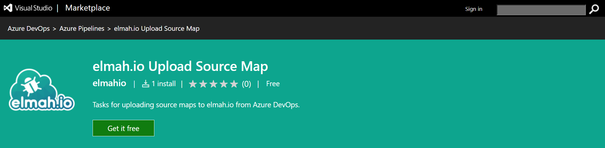
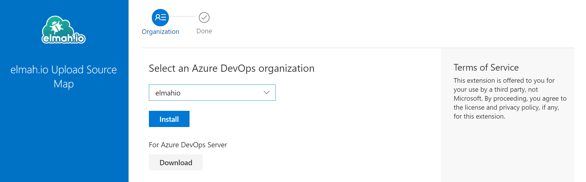
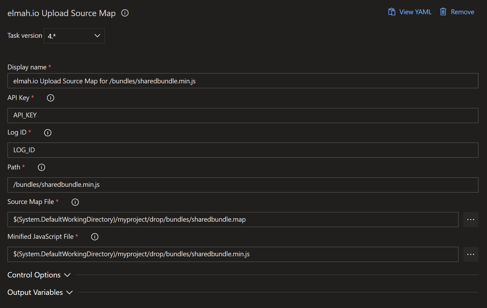

# elmah.io Upload Source Map

This extension is able to upload a source map and a minified JavaScript file to elmah.io. When uploading a source map, bundled and minified stack traces will be readable on elmah.io.

## Usage

1. Go to the [elmah.io Upload Source Map](https://marketplace.visualstudio.com/items?itemName=elmahio.elmah-io-upload-source-map) extension on the Azure DevOps Marketplace and click the _Get it free_ button:

2. Select your organization and click the *Install* button:

3. Go to your Azure DevOps project and add the *elmah.io Upload Source Map* task. Fill in all fields as shown here:

You will need to replace `API_KEY` with an API key ([Where is my API key?](https://docs.elmah.io/where-is-my-api-key/)) with permission ([How to configure API key permissions](https://docs.elmah.io/how-to-configure-api-key-permissions/)) to upload source maps and `LOG_ID` with the ID ([Where is my log ID?](https://docs.elmah.io/where-is-my-log-id/)) of the log the source map belongs to. **Path** must contain the relative path to the minified JavaScript. **Source Map File** and **Minified JavaScript File** must contain a path to the generated source map and minified JavaScript file.